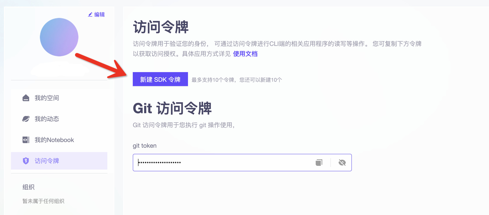

# Introduction

To fuel the Spoken Language Processing (SLP) research on meetings and tackle the key challenges, the Speech Lab and the Language Technology Lab and the ModelScope Community of Alibaba Group, Alibaba Cloud Tianchi Platform, and Zhejiang University launch a **General Meeting Understanding and Generation (MUG)** challenge, as an ICASSP2023 Signal Processing Grand Challenge. To facilitate the MUG challenge, we construct and release a meeting dataset, the AliMeeting4MUG Corpus (AMC).

To the best of our knowledge, AMC is so far the **largest meeting corpus in scale and facilitates the most SLP tasks**. The MUG challenge includes five tracks: Track 1 Topic Segmentation (TS), Track 2 Topic-level and Session-level Extractive Summarization (ES), Track 3 Topic Title Generation (TTG),  Track 4 Keyphrase Extraction (KPE), and Track 5 Action Item Detection (AID).

[Call for Participation](https://modelscope.cn/headlines/article/52)

[Track 1 Topic Segmentation](https://modelscope.cn/competition/12/summary)

[Track 2 Topic-level and Session-level Extractive Summarization](https://modelscope.cn/competition/13/summary)

[Track 3 Topic Title Generation](https://modelscope.cn/competition/14/summary)

[Track 4 Keyphrase Extraction](https://modelscope.cn/competition/18/summary)

[Track 5 Action Item Detection](https://modelscope.cn/competition/17/summary)

[Dataset AliMeeting4MUG](https://modelscope.cn/datasets/modelscope/Alimeeting4MUG/summary)

# Installation

##  Clone the repo
``` sh
git clone https://github.com/alibaba-damo-academy/SpokenNLP.git
```

## Prepare ModelScope SDK Token
Register on the [ModelScope](https://modelscope.cn/home) and get your token in the individual center page. Then **[Modify Configuration Files](src/utils/config.py)**
<div align="left"></div>

## Install Conda
``` sh
wget https://repo.continuum.io/miniconda/Miniconda3-latest-Linux-x86_64.sh
sh Miniconda3-latest-Linux-x86_64.sh
conda create -n modelscope python=3.7
conda activate modelscope
```

## Install Pytorch (version >= 1.12.0)

- CUDA 10.2
    ``` sh
    conda install pytorch==1.12.1 torchvision==0.13.1 torchaudio==0.12.1 cudatoolkit=10.2 -c pytorch
    ``` 
- CUDA 11.3
    ``` sh
    conda install pytorch==1.12.1 torchvision==0.13.1 torchaudio==0.12.1 cudatoolkit=11.3 -c pytorch
    ``` 
- CUDA 11.6
    ``` sh
    conda install pytorch==1.12.1 torchvision==0.13.1 torchaudio==0.12.1 cudatoolkit=11.6 -c pytorch -c conda-forge
    ``` 
For more versions, please see https://pytorch.org/get-started/locally/

## Install ModelScope
``` sh
pip install "modelscope[nlp]" -f https://modelscope.oss-cn-beijing.aliyuncs.com/releases/repo.html
```

## Install other packages
``` sh
pip install -r requirements.txt
```

# Baseline System
## Track 1 Topic Segmentation
```shell
sh run_ponet_topic_segmentation.sh
```
The baseline model is available at [nlp_ponet_document-segmentation_topic-level_chinese-base](https://modelscope.cn/models/damo/nlp_ponet_document-segmentation_topic-level_chinese-base/summary).  
The AMC dev set results from the baseline system and systems based on other backbone models on topic segmentation are as follows:

| Model       | Backbone                                                                                                                                    | Positive F1 | 
|-------------|---------------------------------------------------------------------------------------------------------------------------------------------|-------------|
| Longformer  | IDEA-CCNL/Erlangshen-Longformer-110M                                                                                                        | 23.24±1.35  |
| PoNet(baseline system)       | [damo/nlp_ponet_fill-mask_chinese-base](https://modelscope.cn/models/damo/nlp_ponet_fill-mask_chinese-base/summary) | 25.10±0.55  |

Note: The mean and standard deviation (e.g., for 25.10±0.55, 25.10 is the mean, 0.55 is the std) are reported based on results from 5 runs with different random seeds.

## Track 2 Topic-level and Session-level Extractive Summarization
```shell 
sh run_ponet_topic_extractive_summarization.sh
sh run_ponet_doc_extractive_summarization.sh
```
The baseline model of topic-level ES is available at [nlp_ponet_extractive-summarization_topic-level_chinese-base](https://modelscope.cn/models/damo/nlp_ponet_extractive-summarization_topic-level_chinese-base/summary).  
The AMC dev set results from the baseline system and systems based on other backbone models on topic-level ES are as follows:

| Model       | Backbone                                                                                                                                    | Ave. R1    | Ave. R2    | Ave. RL    | Max R1     | Max R2     | Max RL     | 
|-------------|---------------------------------------------------------------------------------------------------------------------------------------------|------------|------------|------------|------------|------------|------------|
| Longformer  | IDEA-CCNL/Erlangshen-Longformer-110M                                                                                                        | 50.45±0.30 | 34.15±0.48 | 44.62±0.58 | 63.22±0.25 | 50.72±0.31 | 60.36±0.37 |
| PoNet       | [damo/nlp_ponet_fill-mask_chinese-base](https://modelscope.cn/models/damo/nlp_ponet_fill-mask_chinese-base/summary) | 52.52±0.41 | 35.50±0.36 | 45.87±0.44 | 66.43±0.26 | 53.77±0.43 | 63.03±0.27 | 

Note: The mean and standard deviation (e.g., for 25.10±0.55, 25.10 is the mean, 0.55 is the std) are reported based on results from 5 runs with different random seeds. We report both average and best Rouge-1,2,L scores based on the three references.


The baseline model of session-level ES is available at [nlp_ponet_extractive-summarization_doc-level_chinese-base](https://modelscope.cn/models/damo/nlp_ponet_extractive-summarization_doc-level_chinese-base/summary).  
The dev results of baselines on session-level ES are as follows:

| Model       | Backbone                                                                                                                                    | Ave. R1    | Ave. R2    | Ave. RL    | Max R1     | Max R2     | Max RL     | 
|-------------|---------------------------------------------------------------------------------------------------------------------------------------------|------------|------------|------------|------------|------------|------------|
| Longformer  | IDEA-CCNL/Erlangshen-Longformer-110M                                                                                                        | 56.17±0.33 | 29.52±0.65 | 38.20±1.51 | 61.75±0.45 | 36.84±0.61 | 47.06±1.20 |
| PoNet(baseline system)       | [damo/nlp_ponet_fill-mask_chinese-base](https://modelscope.cn/models/damo/nlp_ponet_fill-mask_chinese-base/summary) | 56.82±0.22 | 29.73±0.25 | 37.52±0.74 | 61.66±0.37 | 36.89±0.57 | 46.20±0.56 | 

Note: The mean and standard deviation are reported as 5 times run with different seeds. We report both average and best Rouge-1,2,L scores based on the three references.

## Track 3 Topic Title Generation 
```shell
sh run_palm_topic_title_generation.sh
```
The baseline model of topic title generation is available at [nlp_palm2.0_text-generation_meeting_title_chinese-base](https://modelscope.cn/models/damo/nlp_palm2.0_text-generation_meeting_title_chinese-base/summary).  
The AMC dev set results from the baseline system and systems based on other backbone models on topic title generation are as follows:

| Model   | Backbone                                                                                                                  | Rouge-1 | Rouge-L |
|---------|---------------------------------------------------------------------------------------------------------------------------|---------|---------|
| BART    | fnlp/bart-base-chinese                                                                                                    | 31.06   | 28.92   |
| PALM2.0(baseline system) | [damo/nlp_palm2.0_pretrained_chinese-base](https://modelscope.cn/models/damo/nlp_palm2.0_pretrained_chinese-base/summary) | 31.28   | 29.43   |

- Note: batchsize=4 if gpuMemory = 16G

## Track 4 Keyphrase Extraction
Please refer to [src/keyphrase_extraction/readme](src/keyphrase_extraction/README.md)
 
The baseline model of keyphrase extraction is available at [nlp_structbert_keyphrase-extraction_base-icassp2023-mug-track4-baseline](https://modelscope.cn/models/damo/nlp_structbert_keyphrase-extraction_base-icassp2023-mug-track4-baseline/summary).  
The AMC dev set results from the baseline system and systems based on other backbone models on keyphrase extraction are as follows:

| Model     | Backbone                                                                                                            | Exact/Partial F1 @10 | Exact/Partial F1 @15 | Exact/Partial F1 @20 |
|-----------|---------------------------------------------------------------------------------------------------------------------|----------------------|----------------------| --------------------|
| YAKE      | -                                                                                                                   | 15.0/24.3            | 19.8/30.4            |      20.4/32.1       |
| Bert-CRF  | sijunhe/nezha-cn-base                                                                                               | 35.6/43.2            | 38.1/49.5            |      37.2/48.1       |
| Bert-CRF(baseline system)  | [damo/nlp_structbert_backbone_base_std](https://modelscope.cn/models/damo/nlp_structbert_backbone_base_std/summary) | 35.9/47.7            | 40.1/52.2            |      39.4/51.1       |

## Track 5 Action Item Detection
```shell
sh run_structbert_action_item_detection.sh
```

The baseline model of action item detection is available at [nlp_structbert_alimeeting_action-classification_chinese-base](https://modelscope.cn/models/damo/nlp_structbert_alimeeting_action-classification_chinese-base/summary).  
The AMC dev set results from the baseline system and systems based on other backbone models on action item detection are as follows:

| Model      | Backbone                                                                                                            | Positive F1 |
|------------|---------------------------------------------------------------------------------------------------------------------|-------------|
| BERT       | [mengzi-bert-base](https://modelscope.cn/models/langboat/mengzi-bert-base/summary)                                  | 68.15       |
| StructBERT(baseline system) | [damo/nlp_structbert_backbone_base_std](https://modelscope.cn/models/damo/nlp_structbert_backbone_base_std/summary) | 69.43       |


# Offline Evaluation
if you want to run evaluation and get rank score on dev dataset, please refer to utils/challenge_evaluate.py

# Additional Notes on Code
- Task Evaluation and Rank Score Computation: metrics/* and utils/challenge_evaluate.py 
- Get Dataset and Parse for each task: please read alimeeting4mug_data_download function in each tasks baseline.

# Contact

If you have any questions about AliMeeting4MUG, please contact us by

- email: [icassp2023-mug-challenge@list.alibaba-inc.com](icassp2023-mug-challenge@list.alibaba-inc.com)

- Dingding group:
<div align="left"></div>

# Acknowledgement

1. We borrowed a lot of code from [ModelScope](https://modelscope.cn/home) and [Transformers](https://huggingface.co/docs/transformers/main/en/index).

# License
This project is licensed under the [Apache License 2.0](./../LICENSE). This project also contains various third-party components and some code modified from other repos under other open source licenses.
