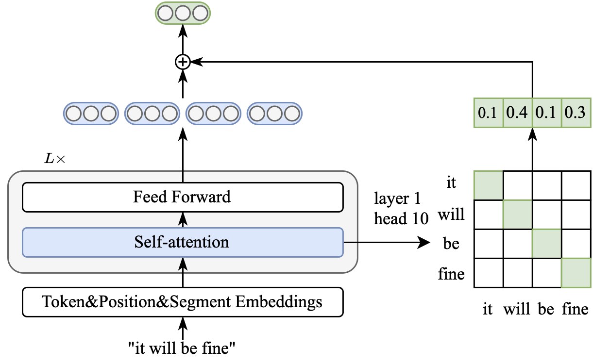

# Ditto: A Simple and Efficient Approach to Improve Sentence Embeddings

This repository contains the code for our EMNLP 2023 paper [Ditto: A Simple and Efficient Approach to Improve Sentence Embeddings](https://arxiv.org/abs/2305.10786). 

## Overview
Prior studies diagnose the anisotropy problem in sentence representations from pre-trained language models, e.g., BERT, without fine-tuning. Our analysis reveals that the sentence embeddings from BERT suffer from a bias towards uninformative words, limiting the performance in semantic textual similarity (STS) tasks. To address this bias, we propose a simple and efficient unsupervised approach, Diagonal Attention Pooling (Ditto), which weights words with model-based importance estimations and computes the weighted average of word representations from pre-trained models as sentence embeddings. Ditto can be easily applied to any pre-trained language model as a postprocessing operation. Compared to prior sentence embedding approaches, Ditto does not add parameters nor requires any learning. Empirical evaluations demonstrate that our proposed Ditto can alleviate the anisotropy problem and improve various pre-trained models on the STS benchmarks.



## Installation
### Clone the repo

```shell
git clone https://github.com/alibaba-damo-academy/SpokenNLP.git
```

### Install Conda

```shell
wget https://repo.continuum.io/miniconda/Miniconda3-latest-Linux-x86_64.sh
sh Miniconda3-latest-Linux-x86_64.sh
conda create -n ditto python=3.7
conda activate ditto
```

### Install other packages
```shell
cd SpokenNLP/ditto
pip install torch==1.7.1+cu110 -f https://download.pytorch.org/whl/torch_stable.html
pip install -r requirements.txt
```


## Evaluation

Before evaluation, please download the evaluation datasets by running
```bash
cd SentEval/data/downstream/
bash download_dataset.sh
```

Then come back to the root directory, you can evaluate any `transformers`-based pre-trained models using our evaluation code. For example,
```bash
bash run_eval_ditto.sh
```

## Citing
If this project are helpful to your research, please cite:

```shell
@article{chen2023ditto,
  author       = {Qian Chen and
                  Wen Wang and
                  Qinglin Zhang and
                  Siqi Zheng and
                  Chong Deng and
                  Hai Yu and
                  Jiaqing Liu and
                  Yukun Ma and
                  Chong Zhang},
  title        = {Ditto: A Simple and Efficient Approach to Improve Sentence Embeddings},
  booktitle    = {EMNLP 2023},
  year         = {2023},
  publisher    = {Association for Computational Linguistics},
}
```

## Acknowledgement
We borrowed a lot of code from [SimCSE](https://github.com/princeton-nlp/SimCSE).

## License
This ditto project is developed by Alibaba and based on the SimCSE project
Code is distributed under the MIT License.
This project contains various third-party components under other open source licenses. 
See the NOTICE file for more information.