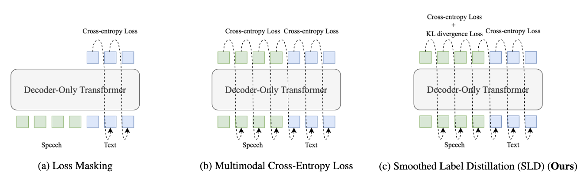

# Loss Masking Is Not Needed in Decoder-only Transformer for Discrete-token Based ASR

This repository contains the code for our ICASSP 2024
paper [Loss Masking Is Not Needed in Decoder-only Transformer for Discrete-token Based ASR
](https://arxiv.org/abs/2311.04534).

## Overview

Recently, unified speech-text models, such as SpeechGPT, VioLA, and AudioPaLM, have achieved remarkable performance on
speech tasks.
These models convert continuous speech signals into discrete tokens (speech discretization) and merge text and
speech tokens into a shared vocabulary.
Then they train a single decoder-only Transformer on a mixture of speech tasks. Specifically, all these models utilize
Loss Masking on the input speech tokens for the ASR task, which means that these models do not explicitly model
the dependency between the speech tokens.
In this paper, we attempt to model the sequence of speech tokens in an autoregressive manner like text. However, we find
that applying the conventional cross-entropy loss on input speech tokens does not consistently improve the ASR
performance over Loss Masking. Therefore, we propose a novel approach denoted Smoothed Label Distillation (SLD), which introduces a KL divergence loss with smoothed labels on the input speech tokens to effectively model speech
tokens. Experiments demonstrate that our SLD approach alleviates the limitations of the cross-entropy loss and
consistently outperforms Loss Masking for decoder-only Transformer based ASR using different speech discretization
methods.


## Installation

### Clone the repo

```shell
git clone https://github.com/alibaba-damo-academy/SpokenNLP.git
```

### Install Conda

```shell
wget https://repo.continuum.io/miniconda/Miniconda3-latest-Linux-x86_64.sh
sh Miniconda3-latest-Linux-x86_64.sh
conda create -n sld python=3.7
conda activate sld
```

### Install other packages

```shell
cd SpokenNLP/sld
pip install torch==1.13.1+cu116 torchvision==0.14.1+cu116 torchaudio==0.13.1 --extra-index-url https://download.pytorch.org/whl/cu116
pip install -r requirements.txt
```

## Training and test

We recommend run the script stage by stage to have an overview of our method.

```bash
bash run.sh
```

## Citation

If this project are helpful to your research, please cite:

```shell
@article{chen2023ditto,
  author       = {Qian Chen and
                  Wen Wang and
                  Qinglin Zhang and
                  Siqi Zheng and
                  Shiliang Zhang and
                  Chong Deng and
                  Yukun Ma and
                  Hai Yu and
                  Jiaqing Liu and
                  Chong Zhang},
  title        = {Loss Masking Is Not Needed in Decoder-only Transformer for Discrete-token Based ASR},
  booktitle    = {ICASSP 2024},
  year         = {2024},
}
```
